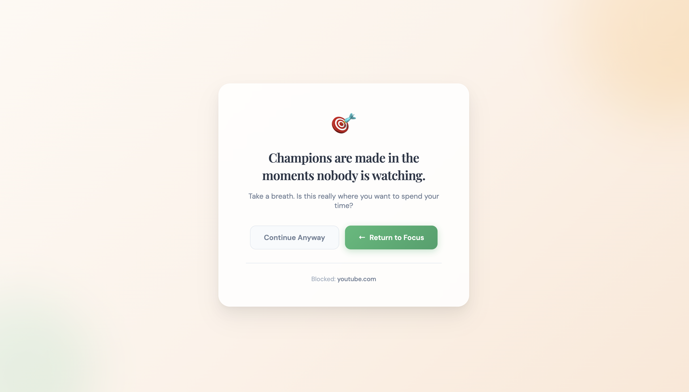
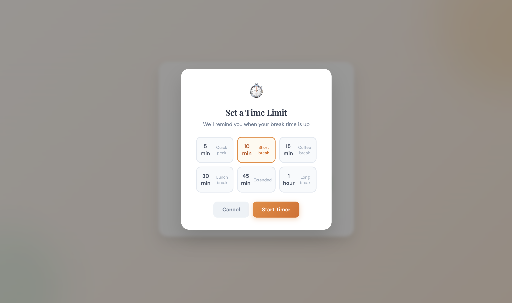
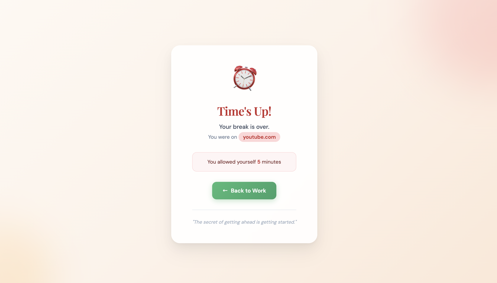
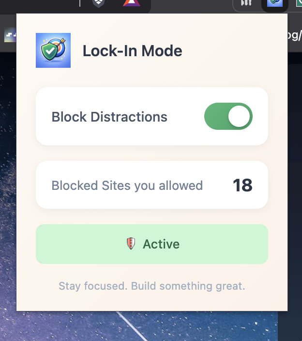

# 🎯 Lock-In Mode

**Stay focused. Block distractions. Build something great.**

Lock-In Mode is a Chrome extension that helps you stay productive by blocking distracting websites and replacing them with motivational quotes. Set time limits for breaks and get reminded when it's time to get back to work.


---

## ✨ Features

### 🚫 Block Distracting Sites
Automatically blocks popular time-wasting sites:
- YouTube
- Instagram
- Twitter / X
- Facebook
- TikTok



### 💬 Motivational Quotes
Instead of seeing distracting content, you're greeted with powerful quotes to keep you focused:

> *"Your attention is your most valuable currency. Spend it wisely."*

> *"The cost of distraction is greater than the cost of focus."*

### ⏱️ Timed Breaks
Need a quick break? Set a timer and browse guilt-free:
- 1 minute (Quick peek)
- 10 minutes (Short break)
- 15 minutes (Coffee break)
- 30 minutes (Lunch break)
- 45 minutes (Extended)
- 1 hour (Long break)



### ⏰ Time's Up Reminder
When your break is over, you'll see a friendly reminder to get back to work.



### 🔘 Easy Toggle
Enable or disable blocking with one click from the toolbar popup.



### 📊 Track Your Progress
See how many times you allowed yourself to visit blocked sites today.

---

## 🚀 Installation

### From Chrome Web Store
1. Visit the [Chrome Web Store](#) *(link coming soon)*
2. Click "Add to Chrome"
3. Pin the extension for easy access

### Manual Installation (Developer Mode)
1. Download or clone this repository
2. Open Chrome and go to `chrome://extensions`
3. Enable "Developer mode" (top right)
4. Click "Load unpacked"
5. Select the `lock-in-mode` folder

---

## 🎮 How It Works

1. **Visit a blocked site** → You'll see a motivational quote instead
2. **Choose your action:**
   - Click **"Return to Focus"** → Goes back to a new tab
   - Click **"Continue Anyway"** → Opens time picker
3. **Set a timer** → Browse the site for your chosen duration
4. **Time's up!** → Get redirected to a reminder page
5. **Decide again** → Get 5 more minutes or return to work

---

## 🔒 Privacy

Lock-In Mode respects your privacy:

- ✅ **No data collection** - We don't track you
- ✅ **No external servers** - Everything stays on your device
- ✅ **No analytics** - Your browsing habits are yours alone
- ✅ **Open source** - See exactly what the code does

---

## 🛠️ Permissions Explained

| Permission | Why We Need It |
|------------|----------------|
| `tabs` | To redirect blocked sites to the block page |
| `storage` | To save your preferences locally |
| `webNavigation` | To detect when you navigate to blocked sites |
| `alarms` | To set break timers |
| `host_permissions` | To detect navigation to specific blocked sites only |

---

## 📁 Project Structure

```
lock-in-mode/
├── manifest.json      # Extension configuration
├── background.js      # Core blocking logic
├── block.html         # Block page with quotes
├── block.js           # Block page functionality
├── timeup.html        # Time's up reminder page
├── timeup.js          # Time's up functionality
├── popup.html         # Toolbar popup UI
├── popup.js           # Popup functionality
└── lock-in-icon.png   # Extension icon
```

---

## 🤝 Contributing

Contributions are welcome! Feel free to:
- Report bugs
- Suggest new features
- Submit pull requests

---

## 📄 License

MIT License - Feel free to use and modify!

---

## 💡 Inspiration

Built for anyone who struggles with digital distractions. Whether you're a student, developer, writer, or professional - Lock-In Mode helps you reclaim your focus.

**Remember:** *"One hour of deep work beats four hours of distracted effort."*

---

Made with ❤️ for productivity

